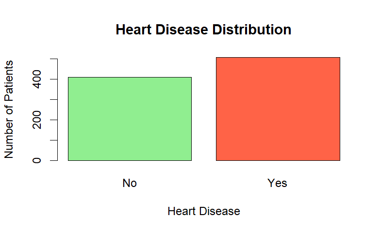
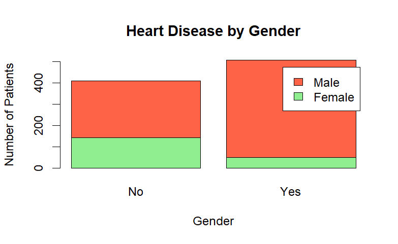
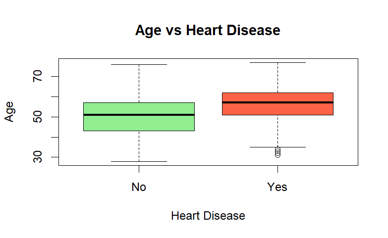
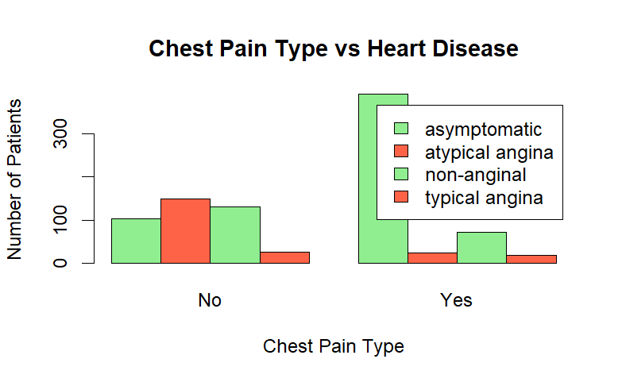
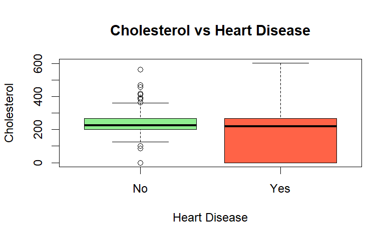
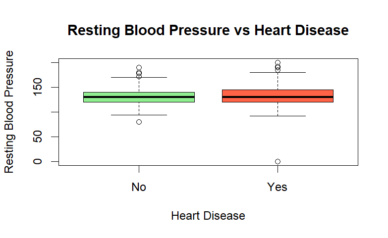
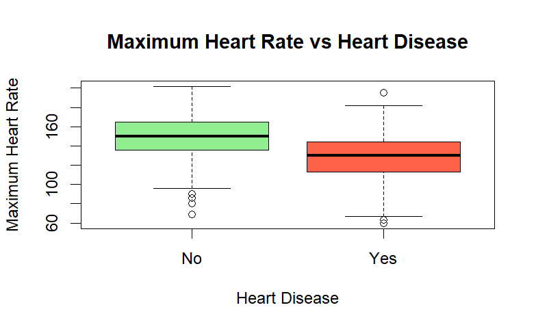
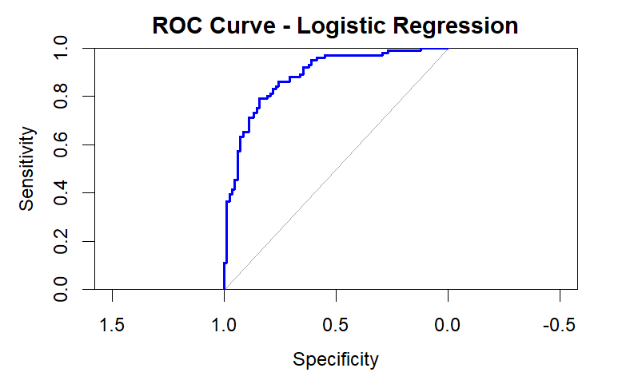

# ❤️ Heart Disease Risk Prediction Using R

An end-to-end healthcare analytics project that predicts heart disease risk using **R** and **Logistic Regression**. This project covers the complete analytics workflow—from data cleaning and exploratory analysis to predictive modeling and model evaluation.

---

## 📖 Project Overview

The goal of this project was to analyze a healthcare dataset and identify the factors that contribute to heart disease. Using R, I cleaned the data, explored patterns, built a Logistic Regression model, and evaluated its performance.

---

## 🎯 What I Did

- Imported and explored the Heart Disease UCI dataset
- Assessed data quality and handled missing values
- Cleaned and prepared the dataset for analysis
- Performed exploratory data analysis (EDA)
- Identified important risk factors
- Built a Logistic Regression model
- Evaluated model performance
- Generated insights to support healthcare decision-making

---

## 🛠️ Tools Used

- R
- RStudio
- Logistic Regression
- Caret
- pROC
- Git
- GitHub

---

## 📂 Dataset

The dataset contains patient information including:

- Age
- Gender
- Chest Pain Type
- Resting Blood Pressure
- Cholesterol
- Fasting Blood Sugar
- Resting ECG
- Maximum Heart Rate
- Exercise-Induced Angina
- ST Depression (Oldpeak)
- Heart Disease Status

---

## 🔄 Project Workflow

```
Raw Data
   ↓
Data Cleaning
   ↓
Exploratory Data Analysis
   ↓
Feature Engineering
   ↓
Train/Test Split
   ↓
Logistic Regression
   ↓
Model Evaluation
```

---

## 📊 Project Visualizations

## 📊 Heart Disease Distribution



## 👨 Heart Disease by Gender



## 📈 Age vs Heart Disease



## ❤️ Chest Pain Type vs Heart Disease



## 🩸 Cholesterol vs Heart Disease



## 🫀 Resting Blood Pressure vs Heart Disease



## 💓 Maximum Heart Rate vs Heart Disease



## 📉 ROC Curve




## 🤖 Machine Learning Model

**Algorithm Used**

- Logistic Regression

**Training/Test Split**

- Training Data: 80%
- Testing Data: 20%

---

## 📈 Model Performance

| Metric | Score |
|---------|-------|
| Accuracy | **80.33%** |
| Precision | **83.51%** |
| Recall | **80.20%** |
| Specificity | **80.49%** |
| F1 Score | **81.82%** |
| ROC-AUC | **0.8837** |

---

## 📋 Confusion Matrix

| Actual | Predicted No | Predicted Yes |
|---------|-------------:|--------------:|
| No | 66 | 16 |
| Yes | 20 | 81 |

---

## 🔍 Key Findings

- Approximately **55%** of patients in the dataset had heart disease.
- Male patients showed a significantly higher prevalence of heart disease.
- Older patients were more likely to have heart disease.
- Asymptomatic chest pain was strongly associated with heart disease.
- Patients with heart disease generally had lower maximum heart rates during exercise.
- The Logistic Regression model achieved **80.33% accuracy** with an **ROC-AUC of 0.8837**, demonstrating strong predictive performance.

---

## 📁 Repository Structure

```
Heart-disease-risk-prediction/

├── Dataset/
│   ├── heart_disease_uci.csv
│   └── heart_clean.csv
│
├── R/
│   └── heart_disease_prediction.R
│
├── Images/
│
├── Dashboard/
│
├── README.md
└── .gitignore
```

---

## 🚀 Future Improvements

- Compare Logistic Regression with Random Forest and XGBoost
- Build an interactive Power BI dashboard
- Develop a Shiny web application
- Explore feature importance and model explainability

---

## 💼 Resume Highlight

> Built an end-to-end healthcare analytics project in R using Logistic Regression to predict heart disease risk. Performed data cleaning, exploratory analysis, predictive modeling, and achieved **80.33% accuracy** with an **ROC-AUC of 0.8837**.

---

## 👨‍💻 Author

**Arun Kothandaraman**

🎓 Master's in Business Analytics  
Northern Arizona University

🐙 GitHub: https://github.com/ArunKothandaraman94

💼 LinkedIn: https://www.linkedin.com/in/arunkothandaraman94
